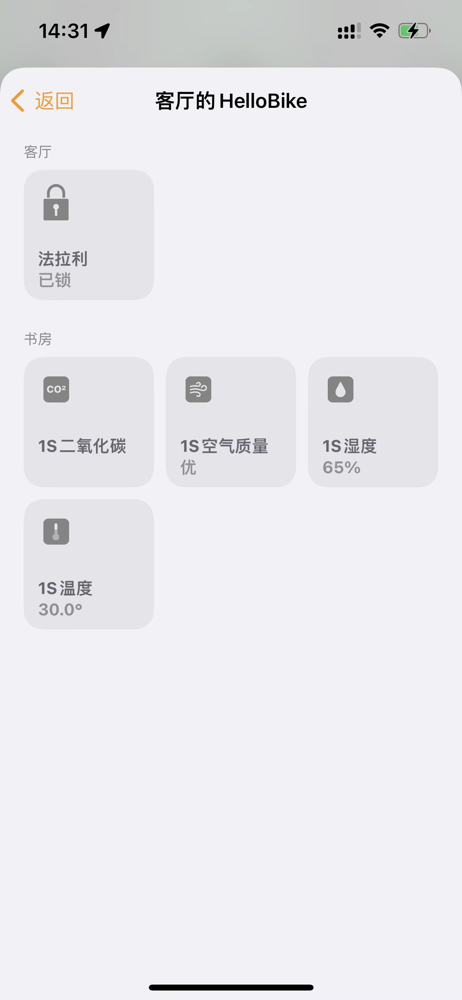
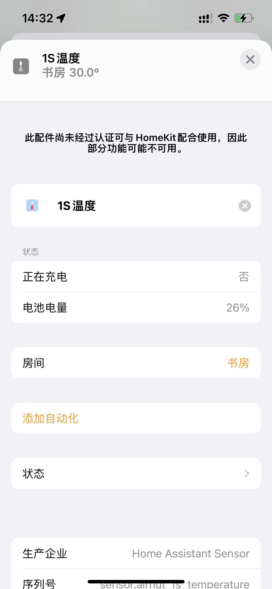

# 空气果 1S Home Assistant 插件 
##HomeAssistant integration For Airnut 1S

### Fork
该仓库fork来源为[billhu1996](https://github.com/billhu1996)的[Airnut](https://github.com/billhu1996/Airnut)进行功能微调与修改。

## 接入方式

1. 在路由器自定义域名（DNS劫持，或其他名字）中设置***apn.airnut.com***指向自己的Home Assistant内网地址，比如我的是***192.168.123.4***，具体方法建议自行搜索。
2. 用[Easylink app](https://www.mxchip.com/easylink/)连接好WiFi后(空气果亮绿灯即连接成功)，双击退出WiFi连接模式。
3. 通过hacs安装，或者复制文件到custom_components
4. 进行如下配置

```yaml
#这个是必须有的
airnut1s:
  #夜间是否更新
  is_night_update: False
  #夜间开始时间
  night_start_hour: 0001-01-01 23:00:00
  #夜间结束时间
  night_end_hour: 0001-01-01 06:00:00

sensor:
#ip为空气果内网的ip地址，空气果1s共六项数据，分别写六个类型的传感器。（温度、湿度、二氧化碳、PM2.5、电量、是否在充电）
  - platform: airnut1s
    ip: "192.168.31.180"
    type: co2
  - platform: airnut1s
    ip: "192.168.31.180"
    type: temperature
  - platform: airnut1s
    ip: "192.168.31.180"
    type: humidity
  - platform: airnut1s
    ip: "192.168.31.180"
    type: pm25
  - platform: airnut1s
    ip: "192.168.31.180"
    type: charge
  - platform: airnut1s
    ip: "192.168.31.180"
    type: battery

#如果有第二个空气果，可以在下面继续，以此类推
  - platform: airnut1s
    ip: "192.168.31.181"
    type: co2
  - platform: airnut1s
    ip: "192.168.31.181"
    type: temperature
  - platform: airnut1s
    ip: "192.168.31.181"
    type: humidity
  - platform: airnut1s
    ip: "192.168.31.181"
    type: pm25
  - platform: airnut1s
    ip: "192.168.31.181"
    type: charge
  - platform: airnut1s
    ip: "192.168.31.181"
    type: battery
```
图例：


## Homekit
```yaml
homekit:
  filter:
    include_entities:
    - sensor.airnut_1s_co2
    - sensor.airnut_1s_pm25
    - sensor.airnut_1s_temperature
    - sensor.airnut_1s_humidity
  entity_config:
    sensor.airnut_1s_co2:
      linked_battery_sensor: sensor.airnut_1s_battery
      low_battery_threshold: 20  #低于多少电显示低电量
    sensor.airnut_1s_pm25:
      linked_battery_sensor: sensor.airnut_1s_battery
      low_battery_threshold: 20
    sensor.airnut_1s_temperature:
      linked_battery_sensor: sensor.airnut_1s_battery
      low_battery_threshold: 20
    sensor.airnut_1s_humidity:
      linked_battery_sensor: sensor.airnut_1s_battery
      low_battery_threshold: 20

homeassistant:
  customize:
    sensor.airnut_1s_co2:
      icon: mdi:molecule-co2
      device_class: carbon_dioxide
      friendly_name: 1S二氧化碳
    sensor.airnut_1s_pm25:
      icon: mdi:blur
      device_class: pm25
      friendly_name: 1S空气质量
    sensor.airnut_1s_temperature:
      icon: mdi:thermometer
      device_class: temperature
      friendly_name: 1S温度
    sensor.airnut_1s_humidity:
      icon: mdi:water-percent
      device_class: humidity
      friendly_name: 1S湿度
    sensor.airnut_1s_battery:
      icon: mdi:battery
      device_class: battery
      friendly_name: 1S电量
    sensor.airnut_1s_charge:
      icon: mdi:battery-charging
      device_class: battery_charging
      friendly_name: 1S充电
```

### 注意
这里不是通过HomeAssistant的UI桥接器接入Homekit,
而是通过HomeAssistant的configuration.ymal配置，可以将传感器与电量绑定，得到设备的电量信息。

按照上述配置后，重载自定义以及homekit后，配对即可发现设备。




## 其他
我不是利益相关方，只是二手产品购买者。

我不会python，只是有需要自己回去搜索一些相关信息去完善一些集成。

如果有大佬可以PR或完善请一定通知一下，共同交流！

# 鸣谢：
- #### 感谢 [hass-xiaomi-miot](https://github.com/al-one/hass-xiaomi-miot) 作者 [@al-one](https://github.com/al-one) 与 交流群 @娄凉生 大佬指导configuration.yaml映射HomeKit配件方案。

## 交流
- QQ群：198841186

- 微信群：(添加该机器人，发送“进群”会自动发送邀请链接）


